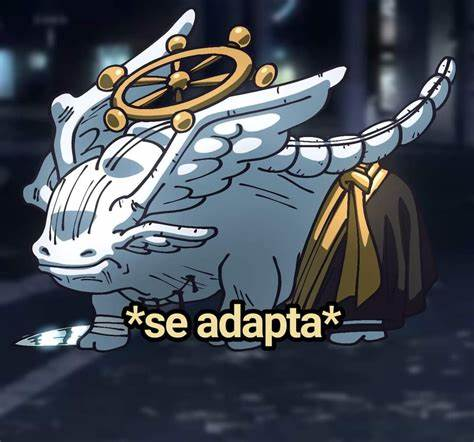

# Restaurante Dijojo

Genuinamente no se que escribir en el readme, tal vez debi empezar a hacerlo en cuanto empece, pero ya quedo asi.

La gran mayoria de cosas relacionadas a NextJs y Backend se aprendieron sobre la marcha y a un ritmo de trabajo de 1 a 2 hrs maximas cada 2 o 3 días segun el trabajo y la escuela me dieran
oportunidad

Mucha de la estructura del proyecto esta mal hecha y se quedo asi por que tardaria mas arreglando eso que continuando asi, pero a comparacion del momento en que inicie
hasta ahora, puedo identificar muchos de mis errores de diseño, los cuales espero poder corregir en, ya sea, actualizaciones proximas o en nuevos proyectos (Tanto personales como laborales)

Al punto de este commit se implementara el Login, o al menos se intentara, ya que es algo que estare aprendiendo sobre la marcha, aunque NextAuth ya esta en el archivo aun no es funcional y se debe corregir.

## Fallos comicos que quiero comentar

- No sabia si poner o no email y lo agregue de ultima, cosa que me retrazo y toco reestructurar muchas cosas, pero termino funcional
- A la hora de hacer la API me dio dolores de cabeza que no me sirviera el "Agregar platillos" pero luego me di cuenta que tenia PUT y no POST en insomnia y por eso no funcionaba

## Conclusion

Pese a que realmente no se como concluir el README del proyecto, sobre todo porque aun no esta terminado, quiero agregar una ligera referencia, la cual es:

Genuinamente durante todo el proyecto, era este:

